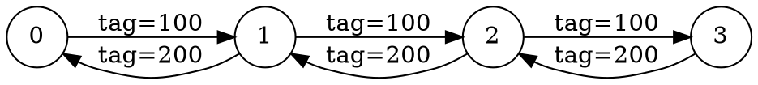

# MPI Sanitizer — Evaluation with Jacobi Iteration Mini-App

## Overview

`miniapp_eval.c` implements a **Distributed 1D Jacobi Iteration** solver,
a classic numerical method for solving partial differential equations (PDEs).
This serves as a realistic MPI workload to evaluate the LLVM MPI Sanitizer's
ability to analyze real scientific applications without false positives.

### What the Mini-App Simulates

- **Domain decomposition**: A 1D array is split across `N` MPI ranks,
  each owning a chunk of 100 doubles.
- **Boundary exchange**: Each iteration, every rank sends its boundary
  values (leftmost and rightmost elements) to its left and right neighbors
  using `MPI_Send` / `MPI_Recv`.
- **Jacobi update**: Each interior cell is updated as the average of its
  two neighbors: `new[i] = 0.5 * (grid[i-1] + grid[i+1])`.
- **Global reduction**: After 10 iterations, `MPI_Allreduce` computes
  the global sum of all grid values.

### Communication Pattern

```
Rank 0 ←→ Rank 1 ←→ Rank 2 ←→ Rank 3
  (chain/ring topology, each rank talks to its immediate neighbors)
```

Each iteration generates `2 × (N-1)` point-to-point messages plus 1
collective (`MPI_Allreduce`) at the end.

---

## Building and Running Through the Sanitizer

### Prerequisites

```bash
sudo apt install -y clang llvm cmake make libopenmpi-dev openmpi-bin
```

### Step 1: Build the Sanitizer (if not already done)

```bash
cd /path/to/LLVM-Secure-MPI-Usage-Sanitizer
mkdir -p build && cd build
cmake .. -DCMAKE_BUILD_TYPE=Debug
make -j$(nproc)
cd ..
```

### Step 2: Compile and Instrument the Mini-App

```bash
mkdir -p out

# Compile to LLVM bitcode
clang -g -O0 -emit-llvm -c $(mpicc --showme:compile) \
    evaluation/miniapp_eval.c -o out/miniapp.bc

# Run the sanitizer pass
opt -load-pass-plugin build/libMPISanitizePass.so \
    -passes=mpi-sanitize out/miniapp.bc -o out/miniapp.inst.bc

# Compile instrumented bitcode and link with runtime
clang -g -O0 out/miniapp.inst.bc -o out/miniapp.inst \
    $(mpicc --showme:link) -Lbuild -lmsan_runtime -lm \
    -Wl,-rpath,$(pwd)/build
```

### Step 3: Run the Instrumented Application

```bash
LD_LIBRARY_PATH=$PWD/build mpirun --oversubscribe -np 4 out/miniapp.inst
```

---

## Expected Sanitizer Output

The mini-app is a **correct** MPI program. The sanitizer should report:

1. **No errors** — all send/recv pairs match in type, size, and tag
2. `[msan][info] Average P2P latency: X.XXXXXX seconds`
3. `[msan][info] Communication graph generated: msan_comm_graph.dot`
4. `[msan][summary]` block with all error counts at **0**

### Sample Output

```
Jacobi iteration complete (10 iterations, 4 ranks x 100 cells). Global sum = ...
[msan][info] Average P2P latency: 0.000123 seconds
[msan][info] Communication graph generated: msan_comm_graph.dot
[msan][summary] ============================================
[msan][summary] MPI Sanitizer — Analysis Complete
[msan][summary] Total events analyzed : 124
[msan][summary] Sends                 : 60
[msan][summary] Recvs                 : 60
[msan][summary] Collectives           : 4
[msan][summary] Matched pairs         : 60
[msan][summary] Unmatched sends       : 0
[msan][summary] Unmatched recvs       : 0
[msan][summary] Errors detected       : 0
[msan][summary]   type-mismatch       : 0
[msan][summary]   size-mismatch       : 0
[msan][summary]   integrity-violation : 0
[msan][summary]   collective-mismatch : 0
[msan][summary]   deadlock-detected   : 0
[msan][summary]   replay-detected     : 0
[msan][summary]   timeout-warning     : 0
[msan][summary]   anomaly-warning     : 0
[msan][summary]   overlap-warning     : 0
[msan][summary] Avg P2P latency       : 0.000123s
[msan][summary] Comm graph written to : msan_comm_graph.dot
[msan][summary] ============================================
```

### Communication Graph (msan_comm_graph.dot)

The generated DOT file should show a chain topology:



---

## Evaluation Results

> Fill in after running the instrumented mini-app.

| Metric | Value |
|--------|-------|
| **Number of MPI ranks** | 4 |
| **Grid size per rank** | 100 |
| **Number of iterations** | 10 |
| **Total MPI events** | |
| **Matched send/recv pairs** | |
| **Unmatched events** | |
| **Errors detected** | |
| **Average P2P latency** | |
| **Runtime (uninstrumented)** | |
| **Runtime (instrumented)** | |
| **Overhead** | |
| **Communication graph** | Chain topology: 0↔1↔2↔3 |

### How to Measure Overhead

```bash
# Uninstrumented run (baseline)
mpicc evaluation/miniapp_eval.c -o out/miniapp_baseline -lm
time mpirun --oversubscribe -np 4 out/miniapp_baseline

# Instrumented run
time LD_LIBRARY_PATH=$PWD/build mpirun --oversubscribe -np 4 out/miniapp.inst
```

---

## MPI Calls Used

| Call | Purpose | Count per Iteration |
|------|---------|-------------------|
| `MPI_Init` | Initialize MPI | 1 (total) |
| `MPI_Send` | Send boundary value to neighbor | 2 × (N-1) |
| `MPI_Recv` | Receive boundary value from neighbor | 2 × (N-1) |
| `MPI_Allreduce` | Global sum after all iterations | 1 (total) |
| `MPI_Finalize` | Cleanup MPI | 1 (total) |

All calls use only the 8 instrumented MPI functions. No `MPI_Scatter`,
`MPI_Gather`, `MPI_Isend`, `MPI_Irecv`, or `MPI_Wait` are used.
